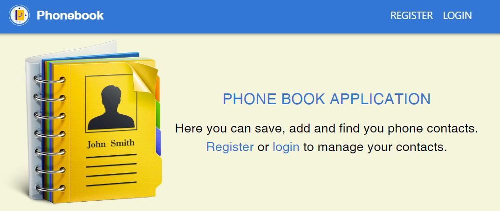

# Книга контактів

## PHONE BOOK APPLICATION

Phone book is an application where you can save, add and find you phone
contacts.

With the added option of registration, you can manage your contacts
confidentially. Also you can log out and then you move to the home page.

When you get to the user account, you can see the user name and the form to add
your contacts.

Once you've added your contacts, you can find them by entering the name of the
contact you're looking for in the form below. Also you can delete the contact.

Backend for this application is created by service mockapi.io.

Styling is done using the library Material UI.

## Technologies

**Front-end**  `React` `ReduxToolkit` `ReduxPersist` `Axios` `HTML/CSS`
`Material UI` `react-loader-spinner` `react-toastify`

**Back-end**  `UI-сервіс https://mockapi.io/`
